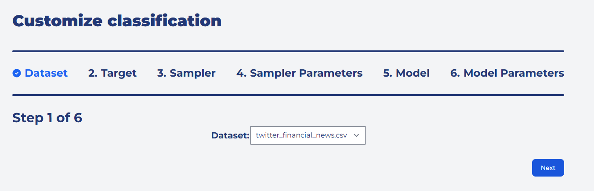
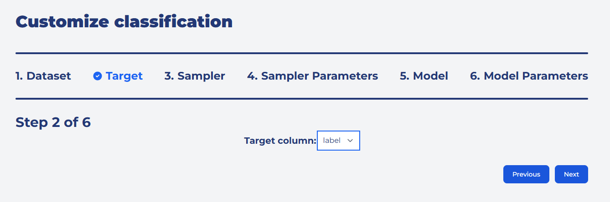
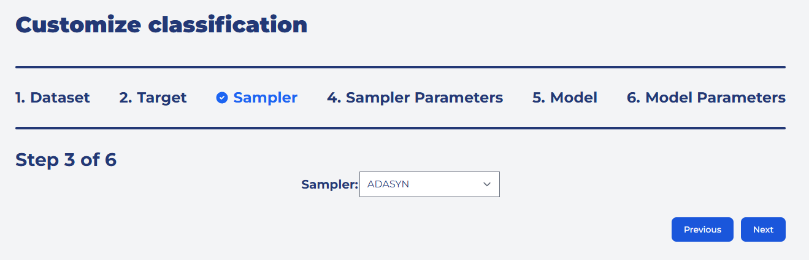
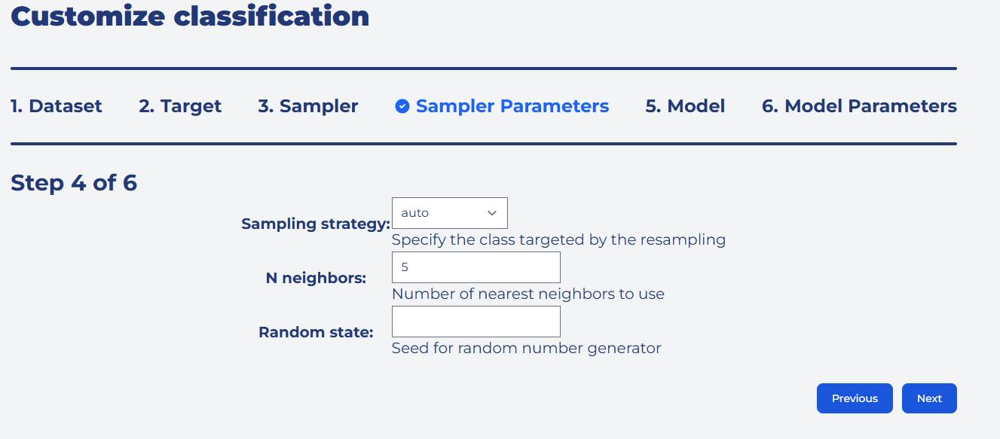
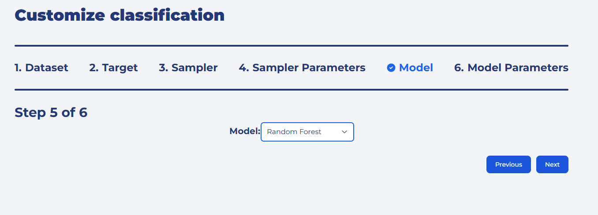
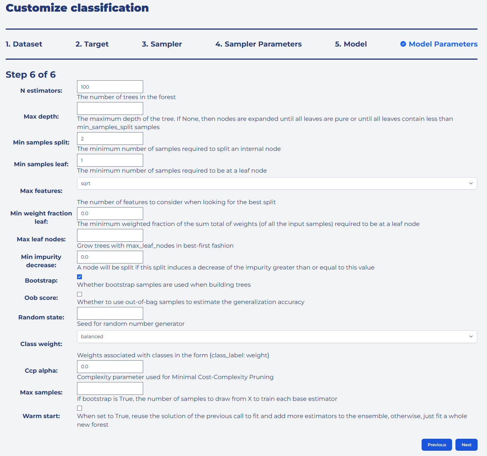
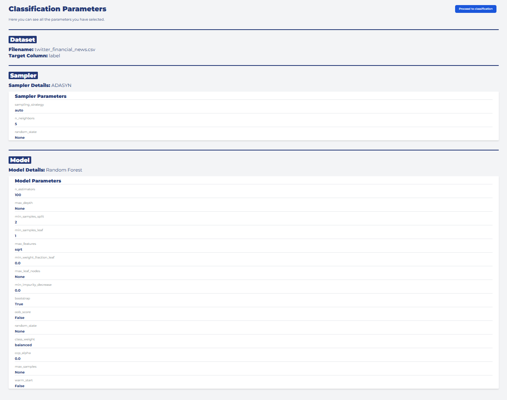
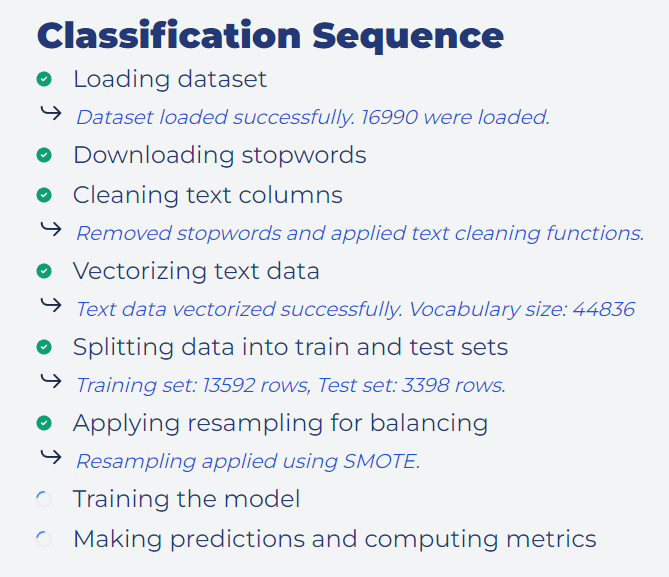

# BalanceIT

[](LICENSE)
[](#)
[](#)
[](#)
[](#)
[](#)

An interactive Django application for analyzing imbalanced text datasets and training classifiers with resampling techniques.

## Features
- Analyze class imbalance with multiple metrics (IR, KL, TV, Hellinger, etc.)
- Wizard-based workflow to pick dataset, target, sampler, and model
- Supports scikit-learn, imbalanced-learn, imbalanced-ensemble, XGBoost, LightGBM
- TF-IDF vectorization, train/test split, model training, and evaluation
- Stores results and datasets per user; login/register flows
- Tailwind CSS UI with ApexCharts visualizations

## UI

Below are snapshots of the BalanceIT interface:

<div align="center">
  
  
</div>

<div align="center">
  
  
</div>

<div align="center">
  
  
</div>

<div align="center">
  
  
</div>

## Tech Stack
- Backend: Django 4, django-crispy-forms, django-formtools
- ML: scikit-learn, imbalanced-learn, imbalanced-ensemble, xgboost, lightgbm, nltk, pandas, numpy
- Frontend: Tailwind CSS, PostCSS, Autoprefixer, ApexCharts

## Getting Started

### Prerequisites
- Python 3.11+
- Node.js 18+

### 1) Python setup
```bash
python -m venv .venv
# PowerShell
. .venv/Scripts/Activate.ps1
pip install --upgrade pip
pip install -r requirements.txt
```

Apply migrations and run the server:
```bash
python manage.py migrate
python manage.py createsuperuser  # optional
python manage.py runserver
```

### 2) Frontend (optional, for CSS builds)
```bash
npm install
# Build Tailwind CSS once
npx tailwindcss -i ./src/styles.css -o ./static/css/styles.css --minify
# Or watch during development
npx tailwindcss -i ./src/styles.css -o ./static/css/styles.css --watch
```

If Tailwind build errors about missing plugins (e.g., Flowbite), install them:
```bash
npm i flowbite
```

### 3) Environment variables
Copy `.env.example` to `.env` and adjust as needed:
```bash
# PowerShell
copy .env.example .env
```
The app reads:
- `DJANGO_SECRET_KEY`
- `DJANGO_DEBUG` ("True"/"False")
- `DJANGO_ALLOWED_HOSTS` (comma-separated)

## Datasets
- Upload CSVs via the UI (recommended)
- The `media/` folder is git-ignored to avoid committing large datasets

## License
MIT. See `LICENSE`.
